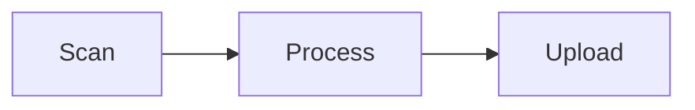

# herdview rich blocks

[herdview](https://github.com/Orchard-Robotics/herdview) mirrors your herdr
session to the phone/desktop web. It renders **your own transcript**, and
upgrades certain fenced code blocks into live UI elements right in the chat —
no artifact upload, no new tab. You emit a fenced block; herdview draws it.

**When to use:** prefer these over prose or a full claude.ai artifact when the
output is a *summary, metric, comparison, progress report, or a small widget*.
Keep them compact — they render inline in a chat bubble.

**When NOT to use:** normal explanation, code you want shown as code, or long
prose. Don't wrap ordinary text in these. If you're not in a herdr session
(`HERDR_ENV` unset), just write normally.

All three are safe: JSON blocks become DOM nodes; the HTML widget runs in a
sandboxed iframe with no network and no access to the page. Malformed input
falls back to a normal code block, so nothing is ever lost. The viewer can turn
rich rendering off (⚙ → "Render rich blocks"); write so it still reads as raw.

---

## ` ```herdview-card ` — a titled card with rows + progress bars

```herdview-card
{
  "title": "Phase 1a verification",
  "status": "ok",
  "rows": [
    {"label": "single-depth frames", "value": "80/80"},
    {"label": "tracking", "value": "3997 rows, no regression"}
  ],
  "progress": [
    {"label": "apples localized", "value": 2035, "max": 3997}
  ]
}
```

- `status` (optional): `ok` | `warn` | `error` | `info` | `none` → a colored pill.
- `rows` (optional): `[{label, value}]` — key/value lines. `value` is shown as text.
- `progress` (optional): `[{label, value, max?, text?}]` — a bar; `max` defaults to
  100, `text` overrides the auto `%` label.

## ` ```herdview-chart ` — a small bar or line chart

Bar (best for comparisons):
```herdview-chart
{ "type": "bar", "title": "runtime (s)", "data": [
  {"label": "baseline", "value": 33.5},
  {"label": "treatment", "value": 47.9}
] }
```

Line / sparkline (best for a trend):
```herdview-chart
{ "type": "line", "title": "loss", "points": [0.9, 0.7, 0.55, 0.4, 0.31] }
```

- `type`: `bar` (uses `data: [{label, value}]`) or `line`/`sparkline` (uses
  `points: [numbers]`, or `data` values).
- `title` optional.

## ` ```html-widget ` — an arbitrary small widget (sandboxed)

For anything the structured blocks can't do — a custom layout, an SVG, a canvas
animation, a tiny interactive control. Write plain HTML (inline `<style>`/`<script>`
allowed). It runs isolated: **no network**, no access to herdview or cookies, and
it auto-sizes to its content.

```html-widget
<div style="padding:10px">
  <b>Depth spread</b>
  <canvas id="c" width="260" height="60"></canvas>
  <script>
    const x = c.getContext("2d"); x.fillStyle = "#2b7563";
    [12,40,28,55,33,48,20].forEach((v,i)=>x.fillRect(i*36+4, 60-v, 28, v));
  </script>
</div>
```

Keep widgets small and self-contained (no external URLs — they're blocked).

---

## ` ```diff ` — a colorized diff

A plain ` ```diff ` fence renders with green additions / red deletions / dimmed
hunk & file headers. Use it to show a proposed or applied change:

```diff
@@ -1 +1 @@
-MAX_APPLES = 10
+MAX_APPLES = 20
```

## Callouts — `> [!NOTE]` and friends

GitHub-style callouts render as colored admonition boxes. Types: `NOTE`, `TIP`,
`IMPORTANT`, `WARNING`, `CAUTION`. Use sparingly for a single key point.

```
> [!WARNING]
> This drops all rows before re-inserting — back up first.
```

## ` ```mermaid ` — a diagram

Standard [Mermaid](https://mermaid.js.org) diagrams (flowchart, sequence, state,
gantt, …) render to SVG. Great for architecture, data flow, or a state machine.



Keep diagrams small — they render inline in a bubble.

## Notes

- These are **inline** — a card/chart/widget appears in the bubble where you
  wrote it. Put a one-line lead-in above it if context helps.
- The block content must be a *complete* fenced block in a single message.
- Numbers render with tabular figures; keep labels short so they fit narrow
  (phone) widths.
